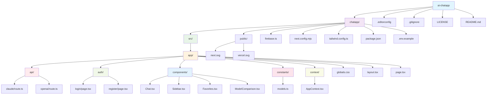

# AI Chat Application

A real-time chat application supporting multiple AI models from OpenAI and Anthropic. Features responsive design, model comparison capabilities, and comprehensive chat management.

## 🚀 Quick Start

```bash
cd chatapp
npm install
cp .env.example .env.local
# Configure your environment variables
npm run dev
```

Open [http://localhost:3000](http://localhost:3000) to start chatting!

## ✨ Key Features

- **Multiple AI Models**: Latest GPT-4.1 series, Claude Sonnet 4, Claude 3.5 Haiku
- **Web Search Integration**: Real-time web search for both Claude and OpenAI models with latest information
- **AI Model Comparison**: Compare responses from multiple models simultaneously
- **Real-time Chat**: Instant messaging with streaming AI responses
- **Multi-room Support**: Create and manage multiple chat rooms
- **Favorites System**: Save and organize favorite AI messages
- **Responsive Design**: Optimized for desktop, tablet, and mobile
- **User Authentication**: Secure login with Firebase Auth

> 📖 **For detailed usage instructions and feature documentation, see [chatapp/README.md](./chatapp/README.md)**

## Project Structure

### 📁 Directory Overview



### 📂 Detailed Structure

```
.
├── chatapp/                 # Main application directory
│   ├── src/                # Source code
│   │   ├── app/           # Next.js App Router
│   │   │   ├── api/       # API routes
│   │   │   │   ├── claude/route.ts    # Claude AI integration
│   │   │   │   └── openai/route.ts    # OpenAI integration
│   │   │   ├── auth/      # Authentication pages
│   │   │   │   ├── login/page.tsx     # Login page
│   │   │   │   └── register/page.tsx  # Registration page
│   │   │   ├── components/ # React components
│   │   │   │   ├── Chat.tsx           # Main chat interface
│   │   │   │   ├── Sidebar.tsx        # Navigation sidebar
│   │   │   │   ├── Favorites.tsx      # Favorites management
│   │   │   │   └── ModelComparison.tsx # AI model comparison
│   │   │   ├── constants/ # Application constants
│   │   │   │   └── models.ts          # AI model definitions
│   │   │   ├── context/   # React context providers
│   │   │   │   └── AppContext.tsx     # Global app state
│   │   │   ├── globals.css            # Global styles
│   │   │   ├── layout.tsx             # Root layout
│   │   │   └── page.tsx               # Home page
│   │   └── favicon.ico    # App icon
│   ├── public/             # Static files
│   │   ├── next.svg       # Next.js logo
│   │   └── vercel.svg     # Vercel logo
│   ├── firebase.ts        # Firebase configuration
│   ├── next.config.mjs    # Next.js configuration
│   ├── tailwind.config.ts # Tailwind CSS configuration
│   ├── postcss.config.mjs # PostCSS configuration
│   ├── tsconfig.json      # TypeScript configuration
│   ├── .env.example       # Example environment variables
│   ├── .env.local         # Local environment variables (not in repository)
│   └── package.json       # Project dependencies and scripts
├── .editorconfig          # Editor configuration
├── .gitignore            # Git ignore rules
├── LICENSE               # License file
└── README.md            # This file
```

## 🛠️ Tech Stack

| Category | Technology | Version | Purpose |
|----------|------------|---------|---------|
| **Framework** | Next.js | 14.2.25 | React-based full-stack framework |
| **Language** | TypeScript | 5.x | Type-safe development |
| **Styling** | Tailwind CSS | 3.4.17 | Utility-first CSS framework |
| **Database** | Firebase Firestore | 11.4.0 | Real-time NoSQL database |
| **Authentication** | Firebase Auth | 11.4.0 | User authentication & management |
| **AI APIs** | OpenAI API | 4.87.4 | GPT models integration |
| **AI APIs** | Anthropic API | 0.39.0 | Claude models integration |
| **State Management** | React Hooks | - | useState, useContext, useEffect |
| **Icons** | React Icons | 5.5.0 | UI icon library |

## 📊 Database Schema

### Firestore Data Model

```
Firestore
├── rooms/{roomId}
│   ├── name: string
│   ├── createdAt: timestamp
│   ├── userId: string
│   └── messages/{messageId}
│       ├── text: string
│       ├── sender: 'user' | 'bot'
│       ├── createdAt: timestamp
│       ├── isRead: boolean
│       └── readAt: timestamp
└── users/{userId}/favorites/{favoriteId}
    ├── messageId: string
    ├── roomId: string
    ├── messageText: string
    ├── createdAt: timestamp
    └── timestamp: timestamp
```

### Key Features Supported:
- ✅ **Multi-room chat** with user isolation
- ✅ **Real-time messaging** with Firestore listeners
- ✅ **Read status tracking** for message management
- ✅ **Favorites system** for important messages
- ✅ **Web search integration** for both Claude and OpenAI models (latest information)
- ✅ **User-specific data** with proper security rules

## ⚙️ Development Setup

### Prerequisites
- Node.js 18+ 
- Firebase project with Firestore and Auth enabled
- OpenAI API key
- Anthropic API key with web search tool enabled in Console
- OpenAI API key (GPT-4o/GPT-4o-mini support web search)

### Environment Configuration

Create `.env.local` in the `chatapp` directory:

```env
# Firebase
NEXT_PUBLIC_FIREBASE_API_KEY=your_api_key
NEXT_PUBLIC_FIREBASE_AUTH_DOMAIN=your_auth_domain
NEXT_PUBLIC_FIREBASE_PROJECT_ID=your_project_id
NEXT_PUBLIC_FIREBASE_STORAGE_BUCKET=your_storage_bucket
NEXT_PUBLIC_FIREBASE_MESSAGING_SENDER_ID=your_sender_id
NEXT_PUBLIC_FIREBASE_APP_ID=your_app_id

# AI APIs
OPENAI_API_KEY=your_openai_api_key
ANTHROPIC_API_KEY=your_anthropic_api_key

# Features
NEXT_PUBLIC_REGISTRATION_ENABLED=true
```

### Available Scripts
```bash
npm run dev          # Start development server
npm run build        # Build for production
npm run start        # Start production server
npm run lint         # Run ESLint
```

## 📄 License

MIT License - see [LICENSE](LICENSE) file for details.

## 🤝 Contributing

1. Fork the repository
2. Create your feature branch (`git checkout -b feature/amazing-feature`)
3. Commit your changes (`git commit -m 'Add some amazing feature'`)
4. Push to the branch (`git push origin feature/amazing-feature`)
5. Open a Pull Request

---

**Built with ❤️ using Next.js and Firebase**
